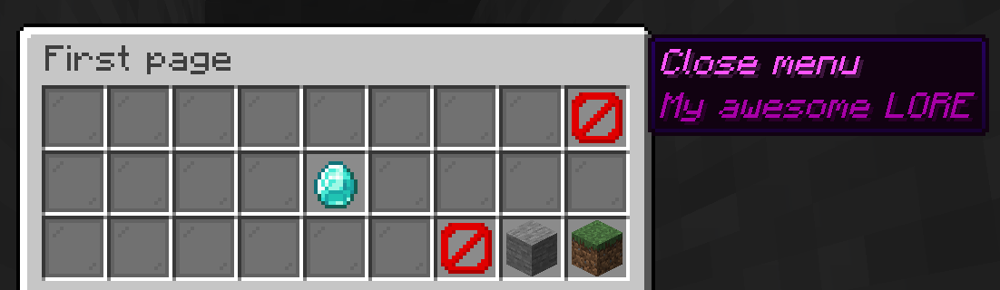

# Custom Chest Menus - Just like you know them from plugin servers

Custom Chest Menus is a mod for Minecraft that allows server owners to create custom chest menus with various functionalities.
This mod is designed to enhance the gameplay experience by providing interactive and customizable interfaces for players.

## Features

Custom Chest Menus enables all server owners to create custom chest menus by writing it out in JSON files.

_If you aren't good with how to write JSON, you can use [this website](https://json.magnusjensen.dk/?utm_source=github&utm_medium=1.20.1&schemaUrl=https%3A%2F%2Fraw.githubusercontent.com%2FMagnusHJensen%2Fcustom-chest-menus%2Frefs%2Fheads%2F1.21.1%2Fdocs%2Fv1.schema.json) to help build out a menu._

### Player
- Open any menu with a single command: `/ccm open <menu_id>`

### Server owners
- Open any menu for a given player with a single command: `/ccm open <menu_id> [player]` _(Requires permission level 2)_
- Create custom chest menus using JSON files
- Reload all menus in-game through a command `/ccm reload` _(Requires permission level 2)_
- Currently supported actions:
    - Teleport to a location (also supports cross dimensions)
    - Craft Items
    - Run a command as player or server
        - Placeholders:
            - `%player%` will be replaced with the player's name.
            - `%uuid` will be replaced with the player's UUID.
        - _In the future more placeholders will be supported_
    - Close menu
    - Pagination
        - Next page
        - Previous page
        - Jump to page

## Wiki

Check out the [wiki](https://github.com/magnushjensen/custom-chest-menus/wiki) for detailed documentation.

If you think anything is missing from the wiki that is unclear, send a message in the discord or open an [improve documentation issue](https://github.com/MagnusHJensen/custom-chest-menus/issues/new?template=3.Improve_docs.md).

## Roadmap

Check out the version [milestones](https://github.com/MagnusHJensen/custom-chest-menus/milestones)

## Links

Join my [Discord](https://discord.gg/PHu8k32M3q) for support and updates! (Just created, so barebones)
- [CurseForge page](https://www.curseforge.com/minecraft/mc-mods/custom-chest-menus)
- [Modrinth page](https://modrinth.com/mod/custom-chest-menus)

## Thanks to

- Keaton42 for creating this fire logo in Paint.net!
- [jaredlll08](https://github.com/jaredlll08) for creating [`Multiloader-Template`](https://github.com/jaredlll08/MultiLoader-Template)
